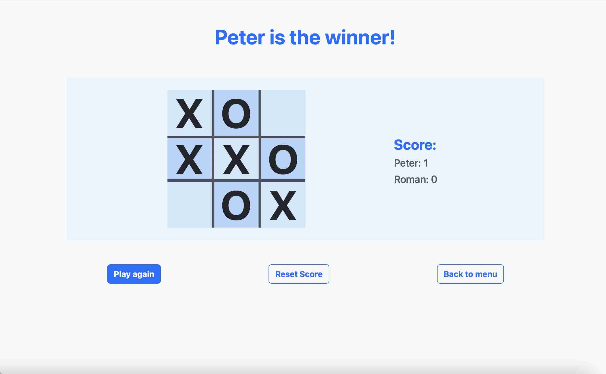

# Tic Tac Toe

## Table Of Contents

* [Description](#description)
* [How To Start The Game](#how-to-start-this-game)
* [Code](#code)
* [Feedback](#feedback)
* [Author](#author)

## Description

A classic game of Tic Tac Toe recreated for the browser in JavaScript. This game is meant to be played by two people simultaneously in order for them to compete against one other in trying to place three signs next to each other in any direction in a grid.

Good luck and have fun!

## How To Start The Game

To start playing Tic Tac Toe, all you have to do is to click on this link: <https://peterroman.codes/tic-tac-toe>.

In the main menu, each player can choose a name which is referenced throughout the game to see whose turn it is, and a sign, which can be placed in the grid. Click the "Start Game" button once the information is filled.

When you're in the game, you can see a message on top indicating whose turn it is, and a grid in the center. The player whose turn it is can click on any empty square in the grid to place the sign. The player who manages to place three signs next to each other in any direction first wins and gets 1 extra point.

When the game is over, there is a possiblity to play again, reset the score for both players, or to go back to the main menu.

## Code

Technologies used:
* HTML
* Bootstrap
* JavaScript

Concepts applied:

* JavaScript
    * control flow
    * web APIs
    * regular expressions
    * functional programming
    * object-oriented programming
    * adding and removing event listeners

### Features

Current features:

* responsive design
    * small screen sizes
        - [x] menu items stack vertically
        - [x] the grid and text in the center stack vertically
        - [x] the grid and text in the center shrink according to the screen size
    * large screen sizes
        - [x] menu items stack horizontally
        - [x] the grid and text in the center stack horizontally
        - [x] the grid and text in the center take up the maximum width

* in the main menu, the "Start Game" button only turns clickable when:
    - [x] both players have chosen a name
        - [x] the name has to have at least 1 character
        - [x] the name can have max 15 characters
    - [x] both players have chosen a sign

* "Start Game" button is clicked
    - [x] the main menu disappears
    - [x] the game appears
    - [x] the score for both players is set to 0
    - [x] the grid is reset

* gameplay
    - [x] players can place a sign on any empty square in the grid
    - [x] once a player has placed a sign, it is the other player's turn
    - [x] when a player places three signs next to each other in any direction, that player wins, gets 1 extra point and it is game over
    - [x] if no player managed to place three signs next to each other in any direction, it's a tie
    - [x] the message on top updates whenever the players change turn

* game over
    - [x] none of the players can place signs
    - [x] "Play Again", "Reset Score" and "Back to Menu" buttons appear

* "Play Again" button is clicked
    - [x] the grid is reset
    - [x] the player who lost in the last game starts in this game
    - [x] players can place signs again

* "Reset Score" button is clicked
    - [x] the score for both players is set to 0

* "Back to Menu" button is clicked
    - [x] the game disappears
    - [x] the main menu appears
    - [x] the players' names and signs are reset
    - [x] the score for both players is set to 0
    - [x] the grid is reset

Future features:

* no future features are currently planned

### Bugs And Issues (Work In Progress)

* no bugs that I know of are currently present in the game

## Feedback

In case you would like to provide feedback on this project, feel free to contact me at peter.roman24[at]gmail.com.

Any feedback is appreciated as I am always trying to improve my skills and work.

## Author

This project is created and maintained by me, Peter Roman.

Connect with me:
* [GitHub](https://github.com/peterRomanDev)
* [LinkedIn](https://www.linkedin.com/in/proman2/)
